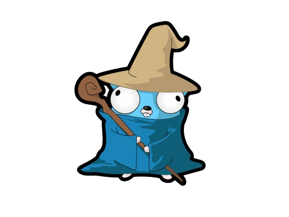

# The Big Book of Small Go Projects 

## Introduction 
This repository is dedicated to learning and mastering Go by working through "The Big Book of Small Python Projects." Each project originally designed for Python is reimplemented in Go, allowing for a unique learning experience in understanding Go's syntax and capabilities. 

## Goals 
- Learn the Go language 
- Create tests in Go
- Make sure to keep all projects in lowest O time complexity. 

 

## Projects List 
As projects are completed, they will be updated here with links to the project files and a brief description. 

1. **Bagels**: Bagels Game  !**Note**:  Uses .env file to set the initial state of the game.

... 
